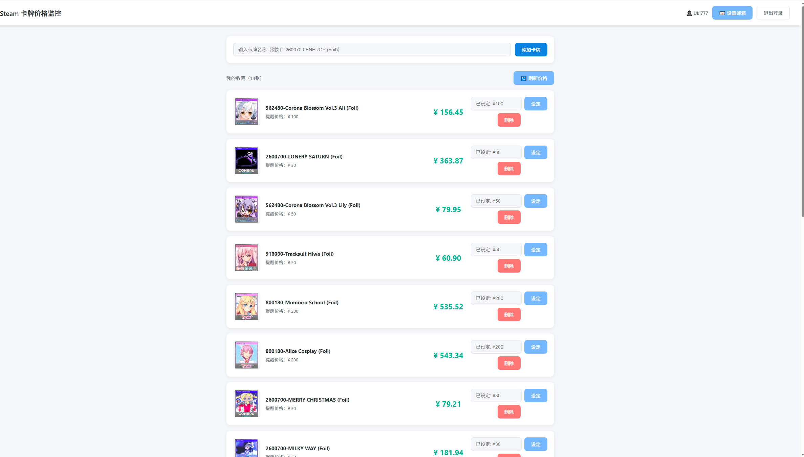
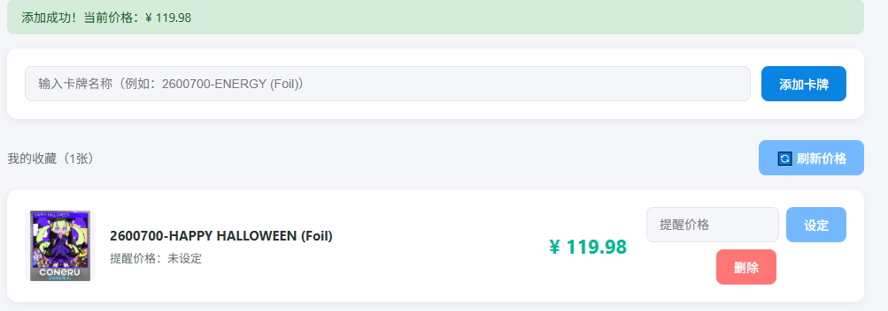
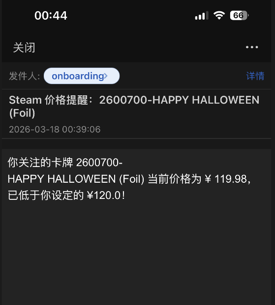

# Steam 冷门闪卡价格监控

自动监控 Steam 市场冷门闪亮集换式卡牌价格，低价时发送邮件提醒。

**在线体验：** [https://web-production-e5562.up.railway.app/](https://web-production-e5562.up.railway.app/)

---

## 功能特性

- 用户系统 — 注册登录，每个用户只能看到自己的收藏
- 卡牌收藏 — 添加目标闪卡，自动获取实时价格和卡面图片
- 价格监控 — 手动一键刷新，或每 30 分钟自动刷新一次
- 邮件提醒 — 价格低于设定期望值时自动发送邮件通知
- 数据持久化 — 使用 PostgreSQL 数据库，重新部署数据不丢失

---

## 效果预览

**主界面**



**添加卡牌**



**邮件提醒**



---

## 技术栈

| 技术 | 用途 |
|---|---|
| Python + FastAPI | 后端 API 框架 |
| SQLAlchemy | ORM 数据库操作 |
| PostgreSQL | 生产环境数据库 |
| JWT Token | 用户身份验证 |
| bcrypt | 密码加密 |
| APScheduler | 定时任务 |
| Resend | 邮件发送服务 |
| Railway | 云端部署平台 |

---

## 快速开始

**1. 克隆项目**

```bash
git clone https://github.com/Gravity2000/steam-cards.git
cd steam-cards
```

**2. 安装依赖**

```bash
pip install -r requirements.txt
```

**3. 创建 `.env` 文件**

```dotenv
RESEND_API_KEY=your_resend_api_key
DATABASE_URL=your_postgresql_url
```

**4. 启动项目**

```bash
uvicorn main:app --reload
```

**5. 打开浏览器访问**

```
http://127.0.0.1:8000
```

---

## 项目结构

```
steam-cards/
├── main.py          # 后端主文件，包含所有 API 接口
├── steam.py         # Steam 市场接口封装
├── auth.py          # 用户认证，JWT Token 生成与验证
├── index.html       # 前端页面
├── requirements.txt
└── .env             # 环境变量（不上传 GitHub）
```

---

## 使用方法

**第一步：注册账号**

填写用户名、密码和邮箱，邮箱用于接收价格提醒，也可以注册后在设置里填写。

**第二步：找到目标闪卡的后缀**

打开 Steam 市场商品页，复制地址栏 `/753/` 后面的部分：

```
https://steamcommunity.com/market/listings/753/2600700-HAPPY%20HALLOWEEN%20%28Foil%29
                                                 ↑ 复制这一段
```

**第三步：添加卡牌**

将后缀粘贴到输入框，点击「添加卡牌」，系统自动获取当前价格和卡面图片。

**第四步：设定期望价格**

在卡牌右侧输入期望价格，点击「设定」，价格低于期望值时自动发送邮件通知。

---

## API 接口

| 方法 | 路径 | 说明 |
|---|---|---|
| POST | `/register` | 用户注册 |
| POST | `/login` | 用户登录 |
| GET | `/cards` | 获取收藏列表 |
| POST | `/cards` | 添加卡牌 |
| DELETE | `/cards/{id}` | 删除卡牌 |
| PUT | `/cards/{id}/alert` | 设定提醒价格 |
| POST | `/refresh` | 手动刷新价格 |
| PUT | `/user/email` | 更新邮箱 |

---

## 注意事项

- 目前仅支持 Steam 集换式卡牌（appid=753）
- Steam 价格接口限制为每分钟 20 次、每天 1000 次，请勿添加过多卡牌
- 邮件由 Resend 服务发送，免费版每天 100 封

---

## License

MIT License
